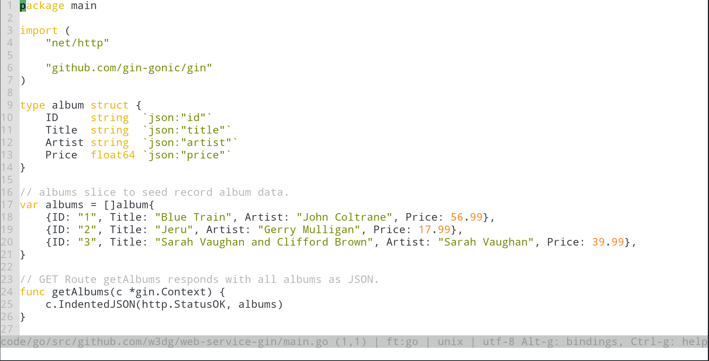
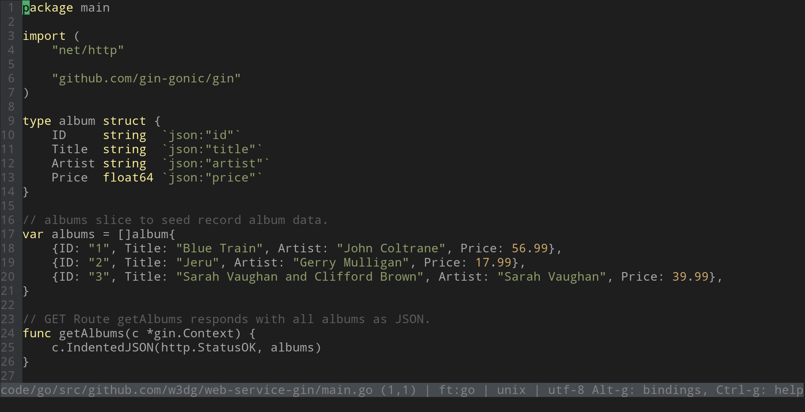

# base16-micro

[Base16](https://github.com/chriskempson/base16) Color Template for [micro](https://github.com/zyedidia/micro/). This template can be used with any compliant Base16 builder such as one from [Tinted Theming](https://github.com/tinted-theming/home#official-builders).

The themes are built into `themes/micro/colorschemes/`. Put the colorscheme files in the `~/.config/micro/colorschemes/` directory.

After this, you can set the scheme by using Micro's command-line:

```
set colorscheme <SCHEME_NAME>
```

## Screenshots

<details>
<summary>Screenshots</summary>
<br>
Tomorrow Dark Night

<br>
Tomorrow

<br>
Twilight

</details>

# Building themes

I am using `tinted-builder-rust` to build the themes from the template.

```sh
cargo install tinted-builder-rust
```

At the root of this repo, run

```sh
tinted-builder-rust build ./
```

The themes should be built into `themes/micro/colorschemes/`. Put the built files in the `~/.config/micro/colorschemes/` directory.

After this, you can set the scheme by using Micro's command-line:

```
set colorscheme <SCHEME_NAME>
```

---

Originally this is the work of [kytta/base16-micro](https://github.com/kytta/base16-micro/) under an ISC License.

I have updated the config of the template to match the [current guidelines](https://github.com/tinted-theming/home/blob/main/builder.md) according to Tinted Theming.
